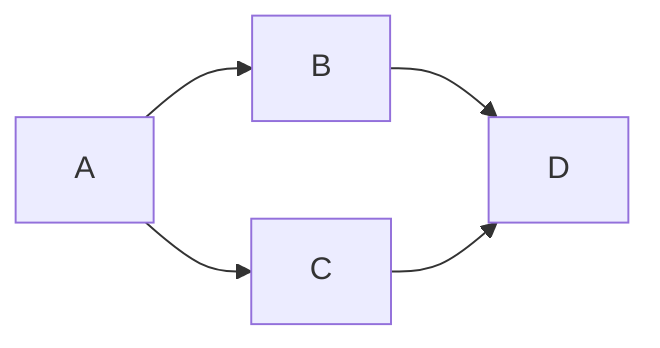

# Desarrollo-De-Interfaces
- Autor: Alexandru Cristian Stinga Micu -
- Github: [xandruUu](https://github.com/xandruUu)
  
# Apuntes de Markdown.
---
## Titulos:

# h1 = #.
## h2 = ##.
### h3 = ###.
#### h4 = ####.
##### h5 = #####.
###### h6 = ######.

---

## Listas:
### Lista desordenada:
Las listas desordenadas se indican con guiones.
- Item 1
- Item 2
  - Item 2.1
  - Item 2.2

### Lista ordenada:
La lista ordenada se indica con numeros y .
1. Item 1
2. Item 2
     1. Item 2.1
     2. Item 2.2

---

## ChekList:
Se hace con un guión Corchetes con un espacio entre ellos : -[] 
Para marcar la casilla se pone una X en minúscula o mayúscula.
- [x] Entrenar.
- [ ] Estudiar Matematicas.
- [x] Hacer Trabajo.
- [ ] Entregar el Trabajo.

---

##  Emojis:
Para poner emojis hay que poner : y con escribir pegado a los dos puntos el objeto en ingles nos saldra el emoji.
Airplane = ✈️ = :chair 
Car = 🚙 = :blue_car 
Chair = 🪑 = :chair 

---

## Estilos de Texto:
**Negrita** o __Negrita__ = ** ** o __ __
*Cursiva* o _Cursiva_ = * * o _ _

---

## Formatos de Texto:
Esto es un <sub>subindice</sub> = < sub >< /sup >


Esto es un <sup>Superindice</sup> = < sup >< /sup >


Esto es un <ins>subrayado</ins> = < ins > < /ins >


> Esto es una quote = >

Este tipo de callouts no funcionan en Github, pero en otros insterpretes si:
>[!info] Nota Informativa

### Texto Preformateado:

Para hacer un texto preformateado debemos abrir y cerrar con tres tildes invertidas

'''

Esto es un texto preformateado

'''

```
Esto es un texto preformateado

```

Este es el comando para inicializar un repositorio de git : `git init` ?Te ha gustado?

---

### Codigo fuente:

Para apuntar codigo de cualquier lenguaje debemos hacer 3 tildes invertidas y el nombre del lenguaje y cerrar con 3 tildes  y escribiremos el código dentro.

'''python

saludo = 'Hola Mundo'
print = saludo

print('Hola Mundo')

'''
Y esto es un ejemplo de código de Python:

```python
saludo = 'Hola Mundo'
print = saludo

print('Hola Mundo')

```

---

## Crear Vinculos:

### Hipervínculo

Para hacer un HiperVinculo  a un texto debemos poner entre corchetes el texto y posteriromente pegado enyre parentesis la url = [] ()

---


### Crear Secciones:

Simplemnete con crear un titulo para una seccion se  crea un vinculo, si usamos el hipervinculo y en los parentesis ponemos #titulo crearemos un hipervinculo a la seccion.

Si queremos hacer un vinculo a archivos de mi propio repo crearemos un hipervinculo pero con el nombre y extension del archivo =  [Fichero leeme.txt] (Leeme.txt)

---


### Crear Imagenes:
Para Insertar imagenes se hace como un hipervinculo normal pero delante de todo se pone una ! y en el parentesis el link de la imagen.

---

! [F15] (https://upload.wikimedia.org/wikipedia/commons/a/a6/F-15C_Eagle_from_the_44th_Fighter_Squadron_flies_during_a_routine_training_exercise_April_15%2C_2019.jpg)


---

## Enlazar una nota al pie

[^1] Esto es una nota al pie.

Esto es otra nota al pie [^Nota]

---

## Tablas

Para crear la tabala demos de utilizar el simbolo: | que sera el cual separara al principio y al fin el titulo de las columnas que queramos crear, posteriormente debajo 

Para alinear contenido en las tablas dentor de los guines debemos indicar a que lado queremos que se acerque el contenido, a la izquierda lo dejmaos nromal, al centor dos puntos a la izquierda y a la derecha de los guiones y a la derecha pues dos puntos a la derecha.

| Columna 1 Izquierda | Columna 2 Centro  | Columna 3 Derecha |
---         | :---:       | ---:       |
| Dato 1 | Dato 2 | Dato 3 |
| Dato 4 | Dato 5 | Dato 6 |

---

## Desplegables

Para  crear despeglables den markdown utilizaremos etiquetas html.

Primeramente creamos la etiqueta details y dentro de la etiqueta creamos otra etiqueta llamada summary que sera la que contiene el otro subtexto y posteriormente duera de summary ponemos el texto qeu quieremos que se intreprete como subtexto.

<details>
  <summary>
    hola
  </summary>
  caracola
</details>

<details>
  <summary>
    Sintaxis de imprimir por pantalla en python
  </summary>

```python
palabra = 'hola'
print(palabra)

  ```
  
</details>


---

## Sistemas de diagramas basados en Texto

### Digrama de flujo orientado de arriba hacia abajo.    


Para crearlo debemos abrir y cerrar tres comillas invertidas y especificar que queremo utilizar mermaid, posteriormente indicaremos que el grafico tiene que ser TD (Top to Down) ( graph TD;), y luego los contenidos debe ser indicados la orientacion con --> si quiero que A vaya B hare A --> B; y ya.

Ejemplo de sintaxis: 


` ` ` mermaid

graph TD;

A-->B;

A-->C;

B-->D;

C-->D;


` ` `

---


---

### Digrama de flujo orientado de izquierda a derecha.

Para crearlo debemos abrir y cerrar tres comillas invertidas y especificar que queremo utilizar mermaid, posteriormente indicaremos que el grafico tiene que ser LR (Left to Right) ( graph LR;), y luego los contenidos debe ser indicados la orientacion con --> si quiero que A vaya B hare A --> B; y ya.

Ejmplo de sintaxis: 


` ` ` mermaid

graph LR;

A-->B;

A-->C;

B-->D;

C-->D;


` ` `

---




---


